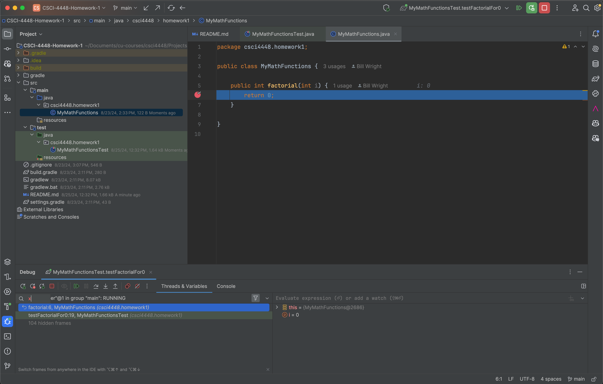

# CSCI 4448/5448 - Fall 2024 - Homework 1

**Value: 20 Points**

The purpose of this homework is to get you familiar 
with the IntelliJ IDEA IDE and the basics of Java 
programming. You will also learn how to use the 
version control system Git and the code hosting 
platform GitHub.

Put your here:

    Name: Neelima Prasad

You'll learn more about the gradle build system, TDD
and testing in general in the next homework. The main
goals of this homework are:

* Get you familiar with the IntelliJ IDEA IDE
* Learn how to write and run tests
* Learn how to use the debugger 
* Learn how to use Git and GitHub (more on this later)

## Things to Know

### Factorial Function

The factorial of a non-negative integer n is the product of all positive integers less than or equal to n. 
The factorial of 0 is 1. Hence:

| n | n! |
|---|----|
| 0 | 1  |
| 1 | 1  |
| 2 | 2  |
| 3 | 6  |
| 4 | 24 |
| 5 | 120|
etc.

### Fibonacci Function

The Fibonacci sequence is a series of numbers in which each number is the sum of the two preceding ones,
usually starting with 0 and 1. The Fibonacci sequence starts with 0, 1, 1, 2, 3, 5, 8, 13, 21, 34, ...

Hence:

| n | F(n) |
|---|------|
| 0 | 0    |
| 1 | 1    |
| 2 | 1    |
| 3 | 2    |
| 4 | 3    |
| 5 | 5    |
| 6 | 8    |
| 7 | 13   |
| 8 | 21   |
etc.

## Steps

1. Clone this repository to your local machine
2. Open the project in IntelliJ IDEA
3. Make all the existing tests pass
4. Write the described tests in the MyMathFunctionsTest class
5. Take a screenshot of debugging one of your tests and add it your repo. Here is an example of what it should look like:

6. Push your changes to your GitHub repository
7. Submit the link to your repository in Canvas
